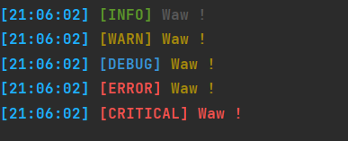

# LogsAPI
LogsAPI in python

# installation 
`pip install simple-chalk`

# How to use

```PYTHON
from logs import *

print(info('Waw !'))
print(warn('Waw !'))
print(debug('Waw !'))
print(error('Waw !'))
print(critical('Waw !'))
```


